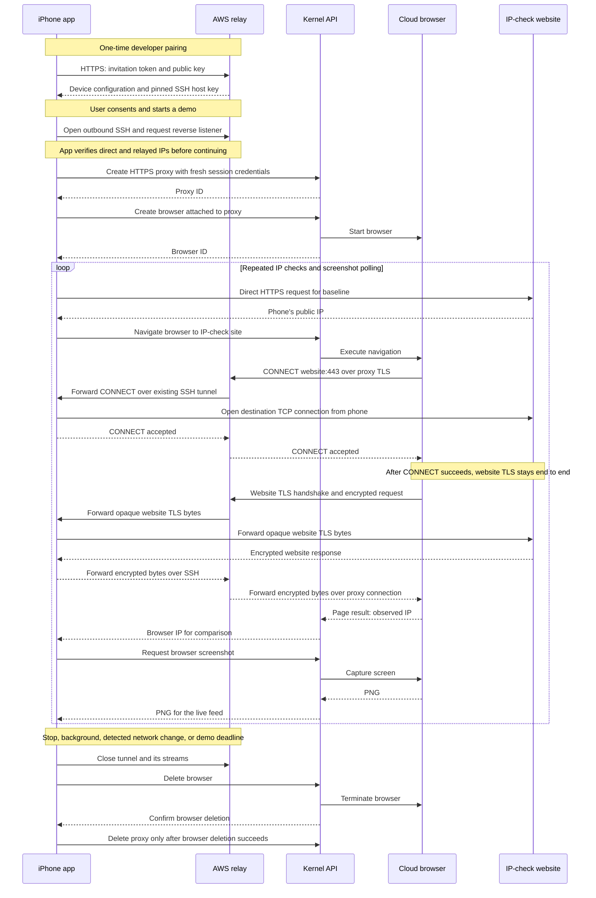

# How device egress works

The browser runs in Kernel’s cloud, but its website connections leave through the user’s device. An AWS Lightsail relay joins those two ends; it is not the website-facing exit node. Websites therefore observe the device’s outbound public IP, including any VPN or carrier routing, rather than the relay’s IP. This demonstrates routing, not an identical local-browser fingerprint or improved checkout success.

## Pair once, connect on demand

The iPhone generates an Ed25519 key and stores its private key in Keychain. For this prototype, an administrator issues a single-use QR invitation that expires after ten minutes. Scanning it sends the invitation and public key over certificate-verified HTTPS. The relay registers a restricted device account and returns its connection settings and pinned SSH host key. Each device has separate credentials, forwarding ports, and SSH restrictions. Repeating the request with the same key recovers a lost response; another device cannot reuse the invitation.

When the user consents and taps Start, an embedded Go library opens an outbound SSH connection to the relay. Because the phone initiates that connection, it needs no inbound port forwarding. SSH exposes a dedicated loopback listener on the relay and carries accepted connections back to the phone’s in-process HTTP CONNECT proxy. The app verifies that direct and relayed IP checks match before creating cloud resources.

## A website request, end to end

The app generates fresh proxy credentials, creates a Kernel custom HTTPS proxy pointing at its assigned relay port, and launches a browser using that proxy. Kernel remains responsible for running the browser; the phone supplies its website connectivity.

For an HTTPS page, the browser’s proxy connection reaches HAProxy on the relay. HAProxy terminates the outer proxy TLS connection and forwards the CONNECT request through the encrypted SSH tunnel. The phone validates authentication, the destination allowlist, and resolved IP addresses, then opens the destination TCP connection itself. That last step makes the phone—not AWS—the exit point.

The browser and website negotiate their own TLS session through this byte-forwarding path. Neither the relay nor the phone decrypts website HTTPS content. No website root certificate or system-wide proxy change is required. Relay administrators can still observe proxy credentials and connection metadata.

## What the screen proves

The app asks Kernel to navigate between two IP-check websites and compares their responses with fresh direct phone requests. Separately, it requests actual browser screenshots approximately every two seconds. These API calls and screenshot downloads go directly between the phone and Kernel; they are not the browser’s proxied website traffic. Matching IPs, screenshots, and traffic counters make the route visible.

Stop, backgrounding, detected network changes, or the demo deadline close the tunnel. Cleanup deletes the browser before its proxy; interrupted cleanup is journaled in Keychain for retry. Removing an attached proxy first could enable direct egress.

## Prototype versus product

QR pairing and entering a Kernel key are developer setup, not proposed consumer onboarding. A production integration would register devices through the app’s backend and keep Kernel credentials server-side. Foreground routing works on the demonstrated iPhone Air; background execution remains unproven. Test-host restrictions, network/lifecycle gaps, and the documented Kernel relay-certificate-verification caveat still require attention before production.

## Sequence

The diagram summarizes the successful path; failed or ambiguous cleanup preserves the proxy until browser deletion is confirmed. Screenshot polling runs independently of navigation.

Implementation: [phone tunnel](../mobile/session.go), [shared CONNECT proxy](../internal/connectproxy/proxy.go), [pairing](../infra/pairing-manager.py), and [demo orchestration](../iOSEgress/iOSEgress/DemoModel.swift). The Mac app uses the same relay and CONNECT handler, with bundled helper processes instead of an embedded iOS library. See [demo setup](ios-demo.md), [current limits](../README.md#limits), and [background follow-up](ios-background-follow-up.md).
