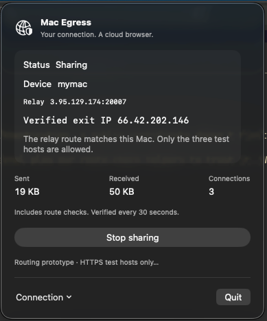

# Mac demo

Share a Mac's internet connection with a Kernel browser. First [create the relay](../README.md#1-create-a-relay); run the commands below from the repository root. Browser verification requires Python 3, Kernel CLI, and a securely supplied `KERNEL_API_KEY`.



## Enroll your Mac

Generate the key **on the Mac**; give only the public key to the relay operator. Return the manifest through a trusted channel.

```bash
umask 077
mkdir -p .local
ssh-keygen -t ed25519 -N '' -f .local/device1

./scripts/tenant.sh list mac-egress-relay
./scripts/tenant.sh enroll mac-egress-relay device1 20000 \
  .local/device1.pub > .local/device1.json
```

Choose an unused name and port (default range: 20000–20009). Revoked names/ports remain reserved.

## Start sharing

Open `MacEgress/MacEgress.xcodeproj`. Select your signing team and **My Mac**, then **⌘R**. Keep App Sandbox off and Hardened Runtime on. Helpers are bundled; running the app requires no developer tools or cloud credentials.

Click the menu-bar network icon. Use **Choose manifest…** for `.local/device1.json` and **Choose private key…** for `.local/device1`—not `.pub`—then **Save device**. Each button shows its selected filename. Hidden files are shown automatically; Xcode debug builds open the repo's `.local` folder.

Check consent and **Start sharing**. Expect **Connecting → Verifying → Sharing**, with an exit IP matching:

```bash
curl -4 --noproxy '*' https://checkip.amazonaws.com/
```

## Test a Kernel browser

Supply `KERNEL_API_KEY` securely in your shell. In the app, choose **Connection → Reveal active session files…**:

```bash
session_dir="/absolute/path/to/the/active/session"
python3 scripts/verify-kernel.py "$session_dir/manifest.json" \
  "$session_dir" .local/kernel-check1
```

This creates a proxy/browser, checks egress, and deletes the browser **before** its proxy. Use a new output directory per run. If cleanup fails, follow its `result.json`; deleting an attached proxy can enable direct egress.

For a disposable device, add `--revoke mac-egress-relay` to test disconnect. This requires AWS access and permanently retires the enrollment.

## Stop / remove

**Stop sharing** or **Quit** closes the app's tunnel and removes session credentials; the Keychain device remains. Let the browser verifier finish first—the app doesn't manage Kernel resources.

```bash
# Retire one device:
./scripts/tenant.sh revoke mac-egress-relay device1
# Remove the relay, disk, keys, and static IP without a snapshot:
./scripts/relay.sh destroy mac-egress-relay
```


[Architecture](how-it-works.md) · [Limits](../README.md#limits) · [Maintenance](../DEVELOPMENT.md)
